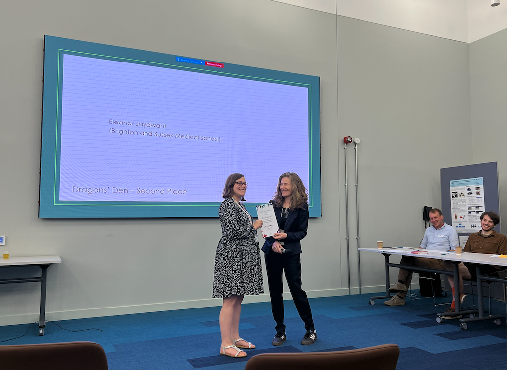

The Sussex ECR Dragons' Den was a competative mutli-round process that saw talented early career reseachers from across the University of Sussex make their pitch for why they should receive research funding to kick start their impactful ideas.

Eleanor pitched an innovative project designed to find kinder ways to treat B-cell lymphomas by looking for therapeutic targets that are specific for malignant cells. She came in 2nd place overall securing £1500 to persue her project, and she hopes to leverage the data she will generate for future fellowship applications.

Huge congratulations to Eleanor, what an incredible job!

