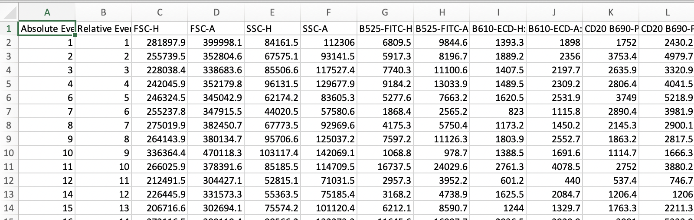

# Link to computational environment.

[Link to computational server](http://139.184.170.218:8000). If you don't know the username/password ask Simon.

# How to make fingerprints:

- Go to [FloReada](https://floreada.io/analysis) and gate out your cells. You can probably do this using FlowJo too.

- Export the cells within the gate as a CSV file, this should give you a CSV file that looks like this when you open it in Excel:

- Do this for every cell populations (FCS) file that you want to analyse to create a bunch of CSV files and save them somewhere on your computer.

- Login to the computational server with the fingerprints user. [Link to computational server](http://139.184.170.218:8000).

- Click on your user folder.

- Drag and drop the CSV files you created into your folder and click upload wen asked.

- Open "Fingerprinting.ipynb"

- Follow the instructions in the file, which will tell you how what to change based on your plotting requirements. Use shift + enter to run each cell.
