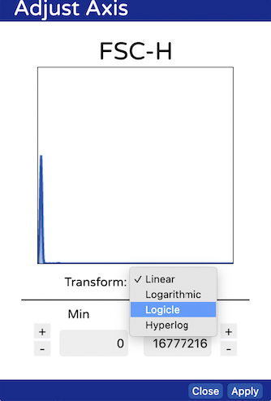
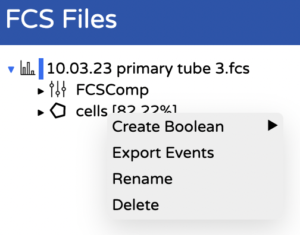

# Link to computational environment.

[Link to computational server](http://139.184.170.218:8000). If you don't know the username/password ask Simon.

# How to make fingerprints:

- Convert your FCS file to a CSV file of events
  - Go to [FloReada](https://floreada.io/analysis) 
  - Upload your FCS file (drag and drop will work.
  - Set the axes on FSC and SSC to "logicle" by clicking on the axes and choosing it from the drop down.
    
  - Create a polgygon gate around your cells
    
  - Export the cells by right clicking on your gate and choosing export events
    
  - Save this file somewhere sensible and repeat for all FCS files you want to analyse (each condition and replicate).
 
- Generate fingerprints using our server
  - Login to the computational server with the fingerprints user. [Link to computational server](http://139.184.170.218:8000).
  - Click on your user folder.
  - Drag and drop the CSV files you created into your folder and click upload wen asked.
  - Open "Fingerprinting.ipynb"
  - Follow the instructions in the file, which will tell you how what to change based on your plotting requirements. Use shift + enter to run each cell. 
  - When you run the final cell it will generate your fingerprints. You can copy and paste these out of the notebook you're running or they will be saved in your user folder and you can download them.
