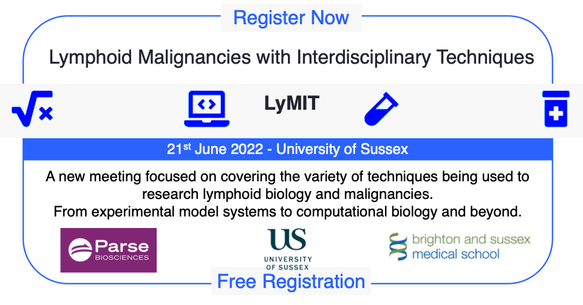
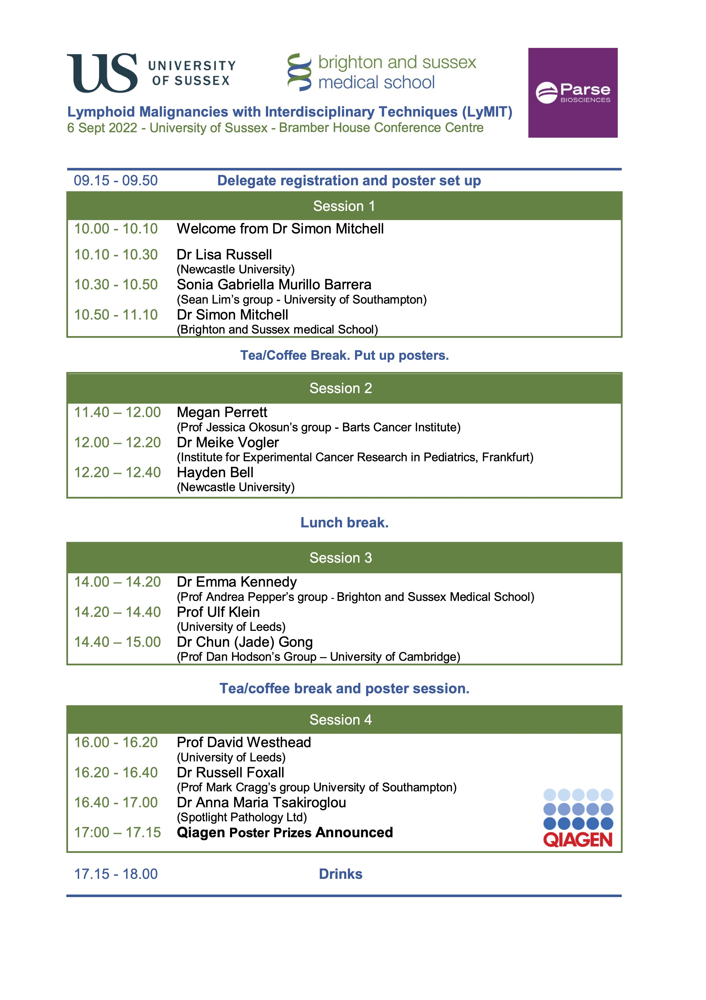

# Event Info

Lymphoid Malignancies with Interdisciplinary Techniques (LyMIT) is a new meeting focused on highlighting exciting novel research that uses interdisciplinary techniques to understand blood cancer. The biological focus is on lymphocyte biology and malignancy, however the techniques are broad – spanning computational biology, animal models, molecular techniques, and everything in between. The meeting is organised by [the Mitchell Group](/) at Brighton and Sussex Medical School (University of Sussex). We have lined up a diverse and exciting lineup of talks and there will be a poster session with prizes for the best poster presentations.

We look forward to seeing you all in June!

[Printable poster can be downloaded here.](https://mitchell.science/PrintableLymitt2022Poster.pdf)

## Registration

Registration is free! [Click here to register](https://www.eventbrite.co.uk/e/lymphoid-malignancies-with-interdisciplinary-techniques-lymit-tickets-256778329897?utm_campaign=post_publish&utm_medium=email&utm_source=eventbrite&utm_content=shortLinkNewEmail)

~~Register by the 2nd May 2022 to receive lunch and refreshments.~~

**Registration deadline extended to 31st may 2022.**

## Speaker Lineup.

The lineup is to be confirmed but includes representatives of many groups leading interdisciplinary approaches to studying lymphoma. The latest lineup is shown below, and can be [downloaded to print here](https://mitchell.science/Lymit-programme.pdf).

## Agenda
- Registration: 9:15-10am.
- Talks: 10am-5:15.
- Drinks: until 6pm.

## Getting here

#### Location

Bramber House. University of Sussex, Brighton, BN1 9QU.

<iframe width="600" height="350" frameborder="0" scrolling="no" marginheight="0" marginwidth="0" src="https://www.openstreetmap.org/export/embed.html?bbox=-0.09531497955322267%2C50.863922603540715%2C-0.08115291595458986%2C50.871100009197264&amp;layer=mapnik&amp;marker=50.867511444503045%2C-0.08823394775390625" style="border: 1px solid black"></iframe> <small><a href="https://www.openstreetmap.org/?mlat=50.86751&amp;mlon=-0.08823#map=17/50.86751/-0.08823">View Larger Map</a></small>

#### By Train

Buy a ticket through to Falmer Station.

Visitors travelling via London and the West need to change trains at Brighton Station for Falmer - the journey to Falmer Station from Brighton takes about nine minutes.

Falmer Station is well served by frequent local trains which run between Brighton and Lewes. You can also travel to Falmer Station from London and the east via Lewes.

For train times, please consult [Southern Railway](https://www.southernrailway.com/)

#### By Car

Parking will be available for free on site.

The Falmer junction for the University of Sussex is on the A27 road between Brighton and Lewes, about four miles (six kilometres) from the centre of Brighton.

Visitors driving from London and the north should follow the M23/A23 road towards Brighton. Before you reach Brighton town centre, take the A27 eastbound (joining visitors travelling from West) which is signposted to Lewes.

Then:

Exit A27 at Falmer and turn left at the first roundabout into the campus.

Drivers from the east going south on the A27. Exit at Falmer junction.

Then:

Exit A27 then turn right (second exit) at mini roundabout. Over bridge and straight on at next roundabout.

### By Taxi

Taxis are available at Brighton and Lewes Railway Stations and in central Brighton; it is about four miles (six kilometres) from the centre of Brighton to the University of Sussex. (There is no taxi service at Falmer Station.) Please note that traffic in Brighton can be congested and it is often quicker to take the train to and from Falmer (journey time about nine minutes).

### By Bus

Bus numbers 25 (or 25a) and 5B run between the centre of Brighton and the universities - from Churchill Square and Old Steine - bringing passengers directly onto the campuses. The 23 bus runs to and from the universities and Brighton Marina via the Kemptown.

In addition, bus services 28, 29, 728 and 729 operate between Brighton (Old Steine) and destinations east of Falmer. These stop outside the University of Sussex.

[Consult Brighton & Hove Bus and Coach Company for times and further details](https://www.buses.co.uk/)

## Accomodation

[View University of Sussex approved hotels and discounts.](https://www.sussex.ac.uk/about/directions/wheretostay)

## Contact

If you have any questions please contact Gemma Hamilton ([HAEM-Oncology@bsms.ac.uk](mailto:HAEM-Oncology@bsms.ac.uk)).

