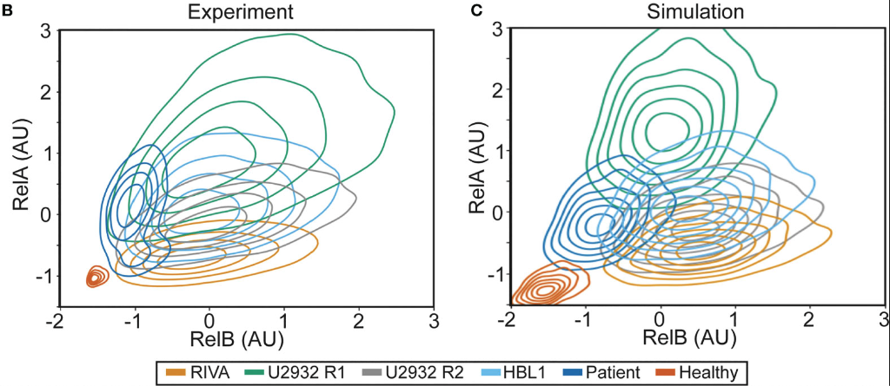

---
publication_types:
  - "2"
authors:
  - Eleanor Jayawant
  - Arran Pack
  - Heather Clark
  - Emma Kennedy
  - Ankur Ghodke
  - John Jones
  - Chris Pepper
  - Andrea Pepper
  - Simon Mitchell
draft: false
abstract: "Introduction. Improving treatments for Diffuse Large B-Cell Lymphoma (DLBCL) is challenged by the vast heterogeneity of the disease. Nuclear factor-κB (NF-κB) is frequently aberrantly activated in DLBCL. Transcriptionally active NF-κB is a dimer containing either RelA, RelB or cRel, but the variability in the composition of NF-κB between and within DLBCL cell populations is not known. 
Results. Here we describe a new flow cytometry-based analysis technique termed “NF-κB fingerprinting” and demonstrate its applicability to DLBCL cell lines, DLBCL core-needle biopsy samples, and healthy donor blood samples. We find each of these cell populations has a unique NF-κB fingerprint and that widely used cell-of-origin classifications are inadequate to capture NF-κB heterogeneity in DLBCL. Computational modeling predicts that RelA is a key determinant of response to microenvironmental stimuli, and we experimentally identify substantial variability in RelA between and within ABC-DLBCL cell lines. We find that when we incorporate NF-κB fingerprints and mutational information into computational models we can predict how heterogeneous DLBCL cell populations respond to microenvironmental stimuli, and we validate these predictions experimentally.
Discussion. Our results show that the composition of NF-κB is highly heterogeneous in DLBCL and predictive of how DLBCL cells will respond to microenvironmental stimuli. We find that commonly occurring mutations in the NF-κB signaling pathway reduce DLBCL’s response to microenvironmental stimuli. NF-κB fingerprinting is a widely applicable analysis technique to quantify NF-κB heterogeneity in B cell malignancies that reveals functionally significant differences in NF-κB composition within and between cell populations."
publication: Frontiers in Oncology
publication_short: Front. Oncol.
featured: true
date: 2023-06-07T08:52:33.502Z

title: NF-κB fingerprinting reveals heterogeneous NF-κB composition in diffuse
  large B-cell lymphoma
doi: https://doi.org/10.3389/fonc.2023.1181660
projects:
  - primary-dlbcl
  - RR-DLBCL
  - NF-kBSignaling
image:
  filename: featured.png
  focal_point: Smart
  preview_only: false
---
NF-κB (my favourite pathway!) is often overly active in lymphoma. But it's really complicated: 2 pathways, 5 proteins, 15 dimers, feedback loops! Different pathways + dimers are active in different patients. Can simulations predict how cells behave, despite this variability?

Firstly we look at gene expression data which shows big differences in the main NF-κB proteins, and no real pattern (left). Simulating these differences (right) suggests they may change how cells respond to signals in the body. But that's gene expression, what about proteins?

We used flow cytometry, which we've found is the best way to get protein measurements, with single cell resolution, for models. (Bonus: Flow works on patient cells and cell lines!) We were surprised to see differences in NF-κB composition even within subclones of a cell line!

Flow is amazing, but it is hard to visualise differences in cell populations. Standarising the data and plotting density as contours revealed unique NF-κB "fingerprints" for each cell population. This is more variability than we were expecting, so we had to try more samples...

Each cell population we tried had a distinct fingerprint: 
- Healthy B-cells sit nicely at the bottom left (low NF-κB) 
- Cell lines are highly variable (Despite these all being ABC-DLBCL lines, they are very different). 
- DLBCL patient cells are distinct again Can we model this?

Yes! Interestingly, we previously measured variability in healthy B-cells, with Koushik Roy in 2018 ([https://pnas.org/doi/full/10.1073/pnas.1715639115](https://t.co/Xg2GCK6N6s)) and it turns out the variability is the same in lymphoma. These models match well but what do they predict?

Arran had to extend the model to capture mutations (see paper). The model predicts that the response to signal is totally different from baseline activation: the most responsive cells are the least active. So we experimentally test this, and find the models work!

So:

* Fingerprinting lets us compare NF-κB in cell lines and blood samples
* It reveals a "boat load" of variability, even within one cell line
* Simulations can match these finerprints
* These simulations accurately predict how cells will respond, despite all this variability!

Moving forward, we think simulations provide a unique tool to combine mutational data, and molecular data, to predict how individual patients will respond to therapy. Keep your eyes peeled for more on this soon!
