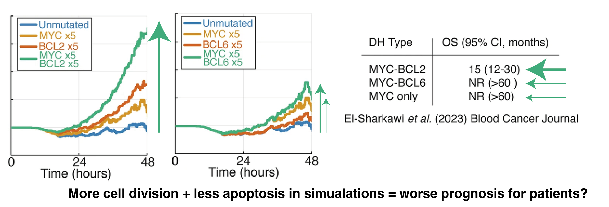

In this study, led by [Richard Norris](/authors/Richard/) we asked: If you take a simulation of healthy cells, and add patient-specific mutations, can you predict patient outcome?

This journey started with the last Figure of [the Immunity paper](/publication/roy-2019-regulatory/) published with Alex Hoffmann and Koushik roy back in 2019. The simulations we were using to understand healthy B-cells looked a bit like lymphoma if we changed the right numbers. So, can we simulate lymphoma?

We first looked at double hit lymphoma (DHL), with mutations in MYC and BCL2/BCL6. These patients have poor prognosis.  The model predicts lots of cells when MYC+BCL2 are mutated but not MYC+BCL6 are mutated. Excitingly, this aligns with prognosis in recent trials!

Does this work with any other patient archetypes?

Yes! Gain1q multiple myeloma is a very poor prognosis B-cell cancer, and if we simulate increasing copies of some key genes involved in the disease the simulation predicts more and more cells with more and more copies of chromosome 1q. This again, aligns with recent clinical trial results, building faith in the model's ability to predict outcome from mutations.

Question: What do the previous combinations of mutations have in common?
A: They are both combinations of mutations that increase cell division and decrease cell death (MYC+BCL2, CKS1B+MCL1). These combination of mutations map to the apoptotic and cell division networks in the mode. Therefore we asked: can we use our simulations to find more lymphoma patients with reduced cell death, and increased cell division?

We took mutational data (WES/WGS/targeted), and created personalised simulations.
Simulating individual patients from Chapuy et al. 2018 revealed patients predicted to have pro-proliferative signaling, anti-apoptotic signaling, neither and both.

How do these patients do? What is their prognosis?

In a discovery cohort and 2 validation cohorts patients predicted to have both anti-apoptotic and pro-prolfierative signalling do much worse.
This is particularly interesting because we only simulate 6 hours of cell signalling, and can predict >10 years of patient outcomes!

Simulations finds poor prognosis patients within all patient groups (cell of origin, genetic clusters, IPI etc).
This means when we combine the model stratification with other metrics we get striking predictions.
The model lets us find patients that won't benefit from R-CHOP.

So to recap: 

* Simulations can reveal when mutations combine in unexpected ways.
* By simulating patients, we can predict when mutations will combine to create "double hit"-like signalling.
* If we want to design clinical trials that succeed should we target these patients?
* Perhaps we can give kinder/reduced treatments to the good prognosis patients?

What's next?

* Now that we can identify patients that need new approaches, can we use these virtual patients to find targeted therapies that will work?
* Could this work in other diseases? Myeloma? CLL? or even breast cancer?

Thank you to [Leukaemia UK ](/project/primary-dlbcl/)and the [UKRI](/project/rr-dlbcl/) for funding this work.
